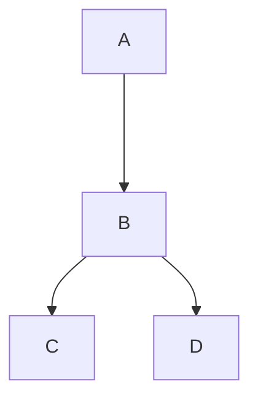
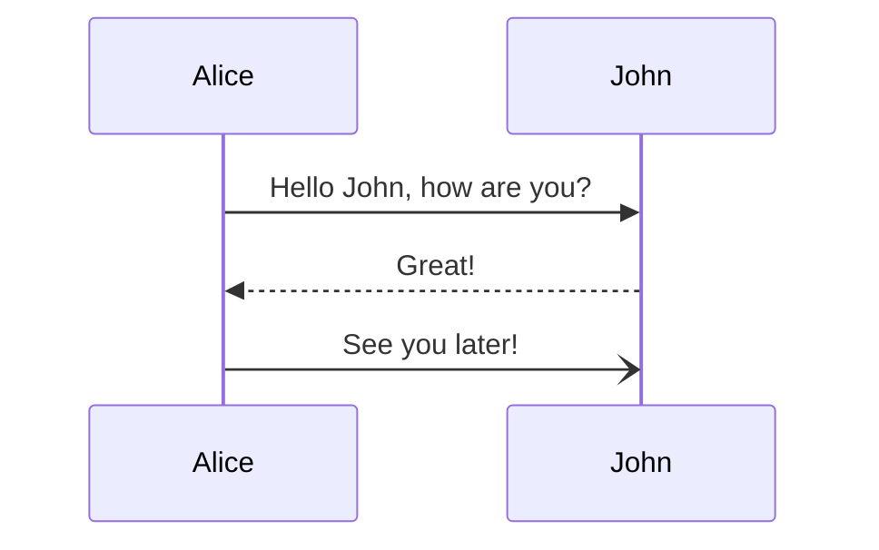

# Title

## Sub-title

### Sub-title-2

#### Sub-title-3

Inline code `code`.`Code added`

This is simple text.

```html
<h1>HTML</h1>
```

```java
public static void main(String args[]){

}
```

    public static void main(){}

> Note!
> > Note2

**Bold**
*Italics*
***Bold Italics***

---

**Link Example:**
[Daolayer Guide](http://vinw12tc3027.eqvm.local:3000/#/)

#### Table

Col1|Col2|Col3
----|----|---
Value1|Value2|**Val3**

#### Lists

- Item1
- Item3
- Item2
  - Sub-item

1. Item1
2. Item2
   1. Sub-Item

#### TODO

- [ ] TODO1
- [x] TODO2

#### UML DIagrams





#### References

- [MermaidJS](https://mermaid-js.github.io/mermaid/#/README)
- [Markdown Basics](https://www.markdownguide.org/basic-syntax/)
